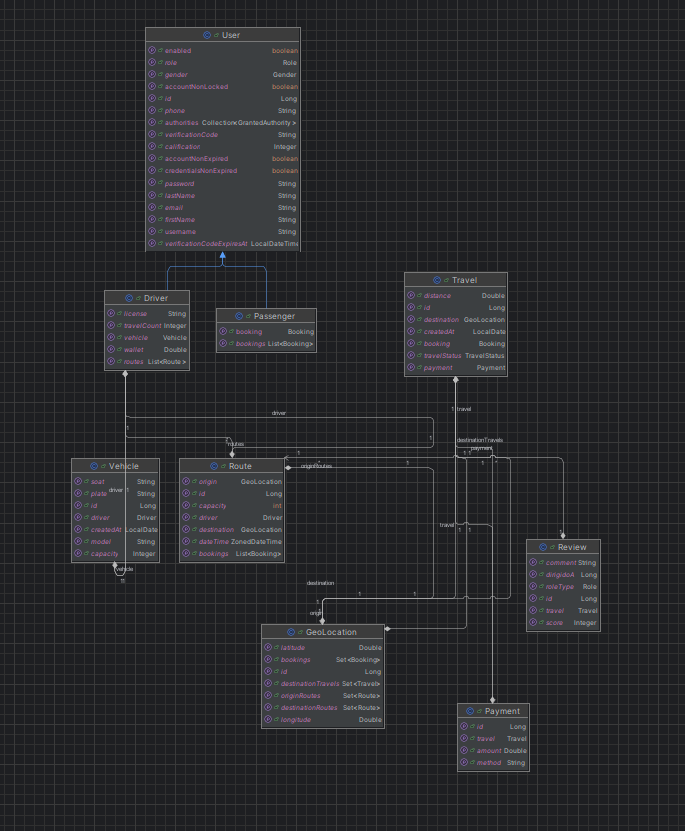

# "Ride-Mates: A greener ride, a more social journey" 🌱🚗

## POSTMAN: 

https://app.getpostman.com/join-team?invite_code=c4210592c1ac3ae458d8a11c06db9c3d&target_code=59618308a15fa54476049f484817c913 

## CS 2031 Desarrollo Basado en Plataformas 💻

## Project Members 🫂

| Name                           | GitHub User            | Email                                       |
|--------------------------------|------------------------|---------------------------------------------|
| Salvador Donayre Epifania      | [*OcZi*](**)             | [*salvador.donayre@utec.edu.pe*](mailto:**)  |
| Adrian Alejandro Montes Vargas | [AdrianMontes0512](**) | [*adrian.montes@utec.edu.pe*](mailto:**)    |
| Nayeli Fernanda Guzman Huayta  | [nayeli-guzman](**)          | [*nayeli.guzman@utec.edu.pe*](mailto:**) |

## Índice 📑
- [Introducción](#introducción)
- [Identificación del Problema o Necesidad](#identificación-del-problema-o-necesidad)
- [Descripción de la Solución](#descripción-de-la-solución)
- [Modelo de Entidades](#modelo-de-entidades)
- [Testing y Manejo de Errores](#testing-y-manejo-de-errores)
- [Medidas de Seguridad Implementadas](#medidas-de-seguridad-implementadas)
- [Eventos y Asincronía](#eventos-y-asincronía)
- [GitHub](#github)
- [Conclusión](#conclusión)
- [Apéndice](#apéndice)

## Introducción 🌟

### Contexto ❓

El nombre "Ride Mates" proviene de la combinación de las palabras "ride" (viaje) y "mates" (compañeros), reflejando la idea de compartir viajes con compañeros de la comunidad universitaria. La iniciativa busca abordar la creciente inseguridad en la zona, especialmente durante la noche, y promover un sentido de comunidad y colaboración entre los miembros de la universidad.

### Objetivos del Proyecto 🎯

- **Desarrollar una aplicación** que ofrezca un transporte seguro y eficiente para los estudiantes de UTEC, conectando a quienes necesitan transporte con aquellos que están dispuestos a ofrecerlo.
- **Crear una aplicación móvil** con funciones clave como perfiles, geolocalización y gestión de reservas.
- **Implementar un sistema de verificación** para asegurar la legitimidad de conductores y pasajeros.
- **Diseñar una interfaz de usuario intuitiva** para mejorar la experiencia del estudiante.
- **Establecer protocolos de seguridad** para proteger la información personal de los usuarios.

## Identificación del Problema o Necesidad 🫡

La idea de "Ride Mates", una aplicación de _carpooling_ para el entorno de UTEC, surge de la creciente inseguridad en la zona, especialmente durante la noche, donde se han ido reportando robos. Los estudiantes, al dirigirse a sus paraderos, están expuestos a peligros. Ante esta situación, "Ride Mates" ofrece una solución de transporte segura. Además de abordar este problema principal, la aplicación tiene el potencial de adaptarse a otros desafíos relacionados.

## Descripción de la Solución 💡

### Funcionalidades Implementadas 🔩

1. **Registro y Autenticación de Usuarios**:
    - Desarrollo de un sistema de autenticación utilizando JWT, que permite a los usuarios registrarse e iniciar sesión de manera segura. El flujo es el siguiente:
    - `/auth/signup`: Permite al usuario registrarse por primera vez en la app, a partir de esto se le mandará un correo con un **Codigo de Verificacion**, si el usuario no coloca este código, no podrá acceder a ningun otro endpoint fuera de `/auth/` 
    - `/auth/verify`: El usuario deberá mandar su **código de veificación**, si es el correcto ya podrá acceder a más endpoints, sino podrá solicitar otro código, este vencerá cada 15 minutos.
    - `/auth/resend` : Sirve para volver a mandarle el **codigo de verificación** al usuario.
    - `/auth/login` : Cuando el usuario haya validado su correo, ya podrá ingresar a su cuenta y tener más accesos.
2. **Funcionalidad de Driver**:
    - Pueden crear rutas, esto con ayuda de ORSapi que les brindará un camino que deberán seguir desde UTEC hasta su punto de llegada establecido por ellos mismos.
    - También pueden cambiar estado de las solicitudes de los passengers
    - Pueden hacer comentarios sobre los pasajeros que han tenido en una ruta.
    - Su `wallet` se actualiza a medida que recibe pagos de un passenger
3. **Funcionalidad de un Passenger**:
    - Pueden generar solicitudes a rutas ya establecidas de los conductores. Estas solicitudes tienen un tope `capacity` de ruta.
    - Al igual que los drivers, estos puede realizar reviews sobre el viaje que recibieron de un conductor.
      - Realizan pagos a los drivers por un viaje adquirido
4. **Eventos Asíncronos:**
    - El backend cuenta con varios eventos que funcionan de manera asincrona, que permiten el envio de correo a nuestros usuarios. Cuando hacen `signup` para el codigo de verificación, cuando el driver cambia el estado de una solicitud, o cuando el passenger borra una solicitud.
5. **Manejo de Errores:**
    - Se retornan excepciones descriptivas en cada posible error, como NotFound, NoAuth, Gone, Forbidden, etc..
6. **Testing**
    - Se realizó testing de todos los controladores de nuestro backend, lo que permitió saber que estos funcionaban con normalidad.
    - Asimismo, se realizó testing en Postman para seguir verificando la validez de nuestros endpoints.

### Tecnologías Implementadas 🛠️

- **Open Route Service**: Para la gestión y creación de rutas.
- **Spring Boot 3.3.4**: Desarrollo del backend y gestión de servicios RESTful.
- **PostgreSQL**: Base de datos relacional principal.
- **H2 Database**: Base de datos en memoria para pruebas.
- **JWT**: Autenticación y autorización de usuarios.
- **Hibernate Validator**: Validación de datos.
- **Testcontainers**: Pruebas de integración con contenedores Docker.
- **Jakarta Mail**: Envío de correos electrónicos.
- **Thymeleaf**: Plantillas HTML para correos electrónicos.
- **Lombok**: Reducción de código repetitivo.
- **OkHttp**: Cliente HTTP eficiente.

## Modelo de Entidades 📊

| Entidad         | Descripción                                                                                                                                             | Relaciones                                                                                                                                              |
|-----------------|---------------------------------------------------------------------------------------------------------------------------------------------------------|---------------------------------------------------------------------------------------------------------------------------------------------------------|
| **User**        | Representa a un individuo registrado en la plataforma Ridemates, que puede ser conductor o pasajero.                                                  | - Un **user** es la clase padre de **driver** y **passenger**.                                                                                       |
| **Passenger**   | Representa a un usuario que busca viajar con conductores, permitiendo solicitar viajes y dejar comentarios.                                            | - Un **passenger** puede realizar muchos **bookings**, pero un **booking** le pertenece solo a un **passenger**.                                      |
| **Driver**      | Ofrece viajes a pasajeros y cuenta con un vehículo y licencia.                                                                                        | - Todos los **drivers** tienen un solo **vehicle**. - Un conductor puede ofrecer más **routes**, pero una **route** le pertenece a un solo **driver**. |
| **Route**       | Representa el camino que el conductor seguirá, determinado por ORSapi.                                                                                | - Un **route** es dado por un único **driver**, permitiendo reservas (**bookings**) de los usuarios.                                                  |
| **Booking**     | Reservas solicitadas por los pasajeros en una ruta existente.                                                                                         | - Un **booking** le pertenece a un **passenger**, pero un **passenger** puede tener de 0 a más **bookings**. - Un **booking** le pertenece a una sola **route**. |
| **Travel**      | Representa un **booking** confirmado por un **driver**.                                                                                              | - Un **travel** le pertenece a un único **booking**, y viceversa.                                                                                     |
| **Review**      | Comentarios que los pasajeros pueden dejar sobre su experiencia con los conductores y viceversa.                                                      | - Cada **review** le pertenece a un único viaje, pero un viaje puede tener de 0 a 2 reviews.                                                           |
| **Payment**     | Representa el pago que el **passenger** hará por su viaje.                                                                                            | - Cada **payment** le pertenece a un viaje, pero un viaje puede tener de 0 a más **payments**.                                                         |
| **GeoLocation** | Coordenada.                                                                                                                                           | -                                                                                                                                                       |
| **Vehicle**     | Información del vehículo de un conductor.                                                                                                            | - Todos los **vehicles** le pertenecen a un **driver**, y cada **driver** tiene un **vehicle**.                                                        |

## Testing y Manejo de Errores 🧪🚨

### Testing 🧪

El proyecto incluye un enfoque exhaustivo de pruebas para asegurar la calidad y funcionalidad:

- **Pruebas Unitarias**: Verifican la lógica de clases y métodos individuales.
- **Pruebas de Integración**: Evalúan la interacción entre componentes del sistema, utilizando **Testcontainers** para un entorno de pruebas aislado. Se utilizó testcontainers para probar la persistencia de datos, especialmente en el caso de **Booking** 
- **Pruebas Funcionales**: Aseguran que las características cumplan con los requisitos del usuario. Probamos todos los controladores de nuestras entidades, con todos lo endpoints, de esta manera nos aseguramos de que funcionen como se espera y retornando os httpresponse adecuados
- **Pruebas de Seguridad**: Verifican la implementación de **JWT** y la protección de endpoints. Se utilizó @WithMockUser con el fin de saber que endpoints son accesibles a ciertos usuarios con ciertos roles.

### Manejo de Errores 🚨

Se implementan estrategias efectivas para el manejo de errores, garantizando una experiencia de usuario fluida:

- **Validación de Entradas**: Uso de **Hibernate Validator** para asegurar datos válidos.
- **Manejo Centralizado de Errores**: Controlador de excepciones global para respuestas claras y coherentes.
- **Respuestas HTTP**: Se devuelven códigos de error significativos:
   - **403: Forbidden**: Acceso denegado a recursos.
   - **410: Gone**: Recursos ya no disponibles.
   - **401: NoAuth**: Autenticación requerida.
   - **404: NotFound**: Recursos no encontrados.
   - **409: Conflict**: Conflictos con el estado actual del recurso.

## Medidas de Seguridad Implementadas 🔒

Implementamos varias medidas de seguridad para proteger los datos y la autenticación de usuarios:

1. **Controlador de Autenticación** 🔐:
   - Rutas para registro, inicio de sesión, verificación y reenvío de códigos.
2. **Servicio de Autenticación** 🛡️:
   - Generación y verificación de códigos de verificación únicos con expiración.
3. **Configuración de Seguridad** ⚙️:
   - Filtrado de solicitudes y gestión de sesiones sin estado (`STATLESS`).
   - Configuración de **CORS** para permitir acceso desde dominios específicos.
4. **Manejo de Errores** 🚨:
   - Respuestas específicas para errores comunes, garantizando claridad y seguridad en la comunicación.

## Eventos y Asincronía 📩⚡

La gestión de eventos en "Ride-Mates" se implementa utilizando un enfoque basado en eventos asíncronos, lo cual permite realizar tareas en segundo plano sin bloquear la ejecución principal. Estas son algunas de las características principales de los eventos implementados:

1. **Definición de Eventos** 📝:
   - Se crean clases específicas para representar los eventos, como `ValidateEvent`, `DeleteBookingEvent`, y `StatusBookingEvent`.
   - Los eventos contienen información relevante para la acción que desencadenan, como detalles del usuario registrado o datos de la reserva.
2. **Manejadores de Eventos** 🎧:
   - Los manejadores escuchan estos eventos y ejecutan acciones específicas en respuesta, como el envío de correos electrónicos o actualizaciones en la base de datos.
   - Cada evento tiene un manejador dedicado que procesa la lógica relacionada de manera eficiente.
3. **Ejemplos de Eventos Utilizados** 🛎️:
   - **`ValidateEvent`**: Se dispara cuando un usuario se registra y necesita verificar su correo electrónico.
   - **`DeleteBookingEvent`**: Se activa al cancelar una reserva, notificando al pasajero correspondiente.
   - **`StatusBookingEvent`**: Se genera cuando hay un cambio en el estado de una reserva.
4. **Asincronía con `@Async`** ⚡:
   - Para mejorar la eficiencia, algunas tareas, como el envío de correos electrónicos, se ejecutan de manera **asíncrona** utilizando la anotación `@Async`.
   - Esto reduce el tiempo de espera para el usuario y optimiza el rendimiento del sistema.
5. **Servicio de Correo Asíncrono** 📧:
   - El **`EmailService`** se encarga de construir y enviar correos electrónicos utilizando plantillas HTML personalizadas.
   - Esto incluye correos de confirmación, actualizaciones de estado y notificaciones de pagos.

Estas prácticas nos permiten mantener la aplicación ágil y responsive, mejorando la comunicación con nuestros usuarios sin afectar el rendimiento general del sistema.

## GitHub 📂

[Repositorio del Proyecto](https://github.com/tu-repositorio)

## Conclusión 🎉

"Ride-Mates" es una solución que aborda la inseguridad en el transporte de estudiantes en la UTEC. Hemos desarrollado una plataforma intuitiva y segura que no solo facilita el transporte, sino que también promueve la colaboración y el sentido de comunidad entre los estudiantes. A medida que avanzamos, consideramos agregar nuevas funcionalidades que enriquecerán aún más la experiencia de los usuarios y mejorarán la seguridad.

## Apéndice 📚

### Posibles Funcionalidades Futuras 🚀
- **Sistema de autenticación con correo estudiantil (oAuth)** 📧.
- **Búsqueda de la mejor ruta de un punto a otro (Distance Matrix API)** 📍.
- **Chat en tiempo real (WebSockets)** 💬.
- **Seguimiento de ubicación en tiempo real (Live Tracking)** 📡.
- **Pasarela de Pagos** 💳.

### Requisitos 📋
Estamos utilizando para la compilación:
- **Java 21** ☕
- **Maven** 🛠️

---
